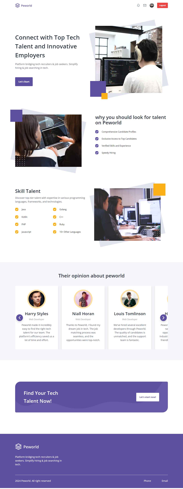
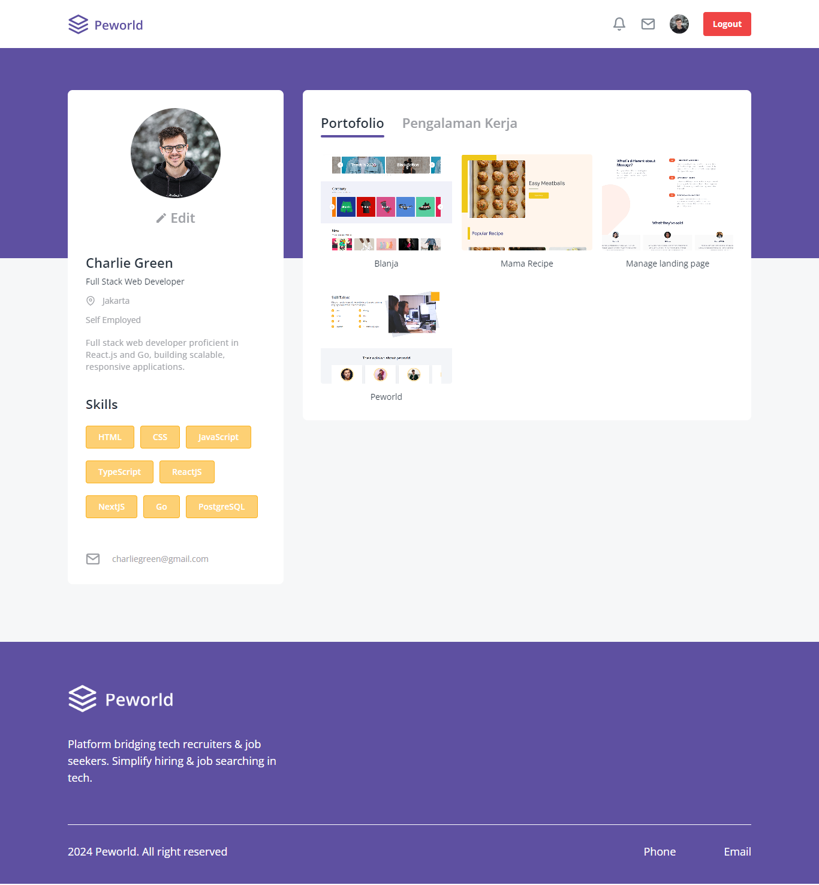

# Peworld - Hire Job App

## Table of Contents

- [About](#about)
- [Features](#features)
  1. [Responsive Design](#responsive)
  2. [Sign Up as Worker or Recruiter](#signup)
  3. [Login](#login)
  4. [Protected Route](#protected-route)
  5. [View Worker Profiles](#worker-profile)
  6. [Edit and Update Profiles](#edit-and-update-profile)
  7. [Manage Skills, Portfolio, and Work Experience](#skill-portfolio-experience)
  8. [Search and Sort Functionality](#search-and-sort)
  9. [Job Offers by Recruiters](#job-offers)
  10. [View Job Offers](#view-job-offers)
- [Pages](#pages)
- [Additional Resources](#resources)

## About

Peworld is an innovative job search application designed to connect leading companies in the technology industry with job seekers.

Companies can find the best talent in the technology field with Peworld!

This website is built with following technologies:

- ReactJS
- Redux
- Tailwind CSS
- Netlify

Explore the platform by visiting [Peworld](https://wafash-peworld-react.netlify.app/) and experience its full range of features.

## Features

1. <a id="responsive">Responsive Design</a>

Peworld is fully responsive, ensuring an optimal user experience across all devices, including desktops, tablets, and smartphones.

2. <a id="signup">Sign Up as Worker or Recruiter</a>

New users can sign up either as a worker or a recruiter, allowing them to access the relevant features and functionalities.

3. <a id="login">Login</a>

Securely log in to your account to access personalized features and manage your profile and interactions.

4. <a id="protected-route">Protected Route</a>

Our website ensures that only authenticated users can access certain routes, providing a secure environment for sensitive information.

5. <a id="worker-profile">View Worker Profiles</a>

Employers can view detailed profiles of workers, including their skills, experience, and portfolio, making it easier to find the right candidate.

6. <a id="edit-and-update-profile">Edit and Update Profiles</a>

Both workers and recruiters can edit and update their profiles, ensuring their information is always current and accurate.

7. <a id="skill-portoflio-experience">Manage Skills, Portfolio, and Work Experience</a>

Workers can display, add, update, and delete their skills, portfolio, and work experience, allowing them to showcase their professional growth and capabilities.

8. <a id="search-and-sort">Search and Sort Functionality</a>

Easily find and organize information with advanced search and sort features, providing quick and relevant results.

9.  <a id="job-offers">Job Offers by Recruiters</a>

Recruiters can send job offers directly to workers, facilitating direct communication and hiring processes.

10. <a id="view-job-offers">View Job Offers</a>

Both recruiters and workers can view the job offers they have sent and received, keeping track of their interactions and opportunities.

## Pages

### Register Page

- Worker

- Recruiter

### Login Page

### Landing Page

### Home Page

### Worker Profile Page

### Worker Edit Profile Page

### Notifications Page

### Recuiter Profile Page

### Recruiter Profile Edit Page

### Hire Page

## <a id="resources">Additional Resources</a>

This section provides essential links and brief descriptions to backend development, API testing, and design guidelines.

- ### Back End Repository

Access comprehensive backend repository built by [Muhammad Risano](https://github.com/muhammadrisano) to understand the structure and functionality of our server-side logic. This documentation includes detailed information on endpoints, request and response formats, authentication methods, and more.

Visit [Back End Repository](https://github.com/wafash08/be-peworld)

- ### Postman Collection

Utilize the Postman collection for efficient API testing and interaction. This collection includes pre-configured requests, environment variables, and detailed examples to help you test and integrate with our API seamlessly.

Visit [Postman Collection](https://documenter.getpostman.com/view/7675329/2s9YysDhDY)

- ### Figma Design Website

Explore the Figma design files to gain insights into the visual and interactive aspects of our website. These files offer detailed views of the design elements, user interface components, and overall layout, ensuring consistency and clarity in the development process.

Visit [Figma Design](https://www.figma.com/design/ZhfxykSA0qzko0PMs9aPOp/HireJob?node-id=0-1&t=TIZ8mPdepplWCBp1-0)
