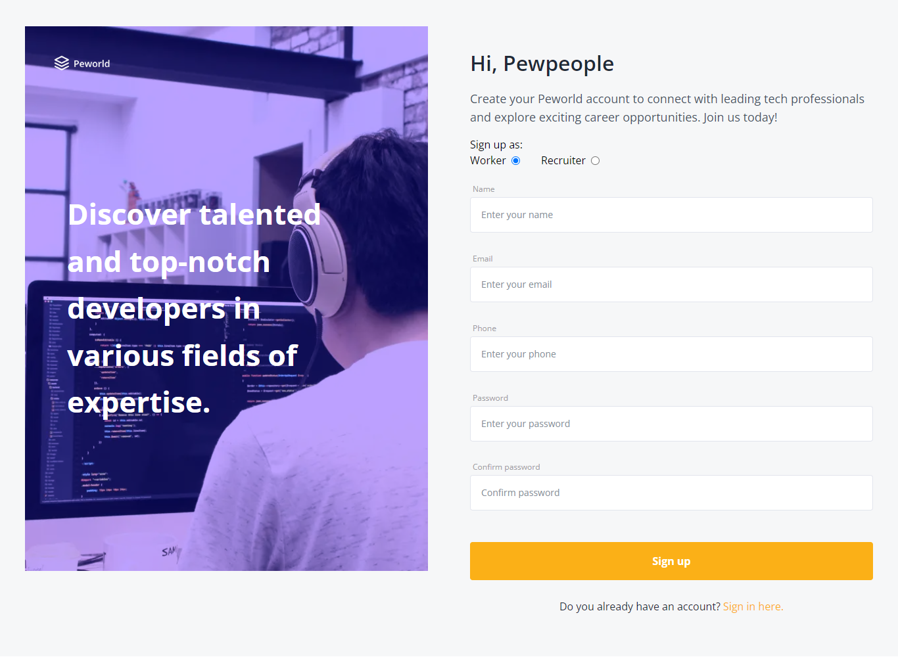
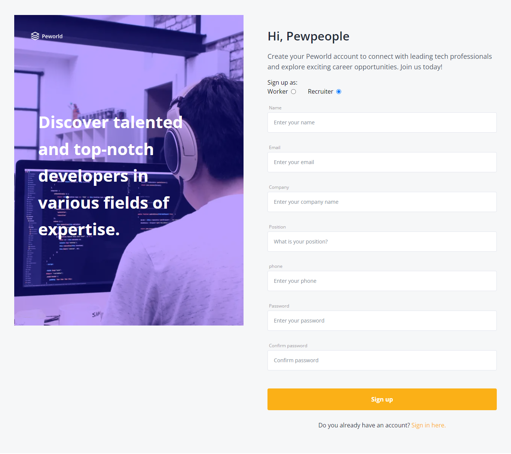
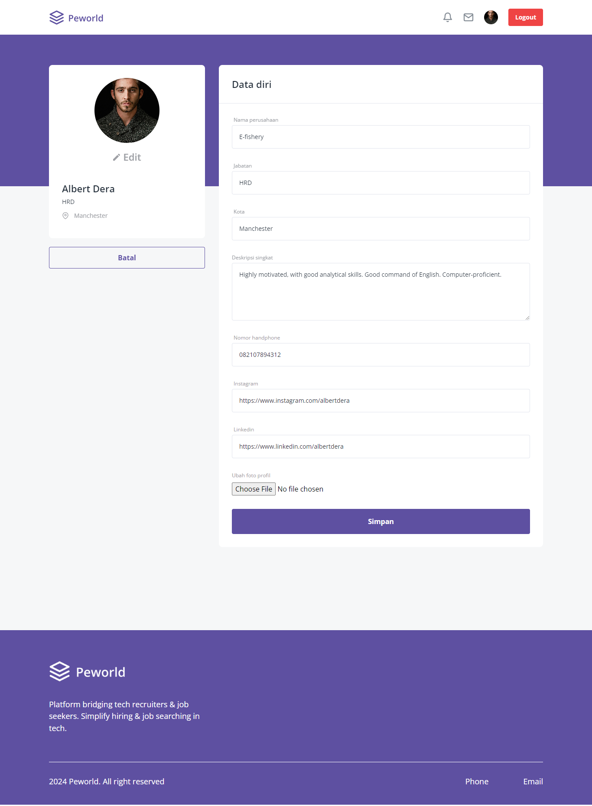

# Peworld - Hire Job App

<div align="center">
  
  <br>
  <br>
  <a href="https://wafash-peworld-react.netlify.app/">View Demo</a>
</div>

## Table of Contents

- [Project Description](#project-description)
- [Technologies Used](#technologies-used)
- [Project Structure](#project-structure)
- [Project Repository](#project-repository)
- [Project Screenshots](#project-screenshots)
- [Getting Started](#getting-started)
- [Contributions](#contributions)
- [License](#license)
- [Contact](#contact)
- [Related Projects](#related-projects)

## Project Description

Peworld is an innovative job search application designed to connect leading companies in the technology industry with job seekers. Our platform allows companies to easily find and recruit the best talent in the technology field. Whether you are a company looking for skilled professionals or a job seeker aiming for your dream job, Peworld provides a seamless and efficient experience for both parties. Join Peworld today and take the next step in your career or hiring journey!

## Technologies Used

This website is built with following technologies:

- ReactJS
- Redux
- Tailwind CSS
- Storybook
- Netlify

Explore the platform by visiting [Peworld](https://wafash-peworld-react.netlify.app/) and experience its full range of features.

## Project Structure

```
└── fwgo-peworld
        ├── .storybook                  # Contains configuration files for Storybook.
        │   └── main.js
        |   └── preview.js
        ├── public                      # Contains the public assets.
        │   └── vite.svg
        ├── screenshots                 # Contains screenshots of the application.
        ├── src                         # Contains the source code of the application.
        │   ├── assets                  # Contains images, icons, and other static assets.
        │   ├── components              # Contains reusable React components.
        │   ├── config                  # Contains configuration files.
        │   ├── pages                   # Contains React components that represent different pages of the application.
        │   ├── redux                   # Contains Redux actions, reducers, and the store configuration.
        │   ├── services                # Contains services for making API calls and other external interactions.
        │   ├── stories                 # Contains Storybook stories for UI components.
        │   ├── auth.js                 # Handles authentication logic.
        │   ├── hooks.js                # Contains custom React hooks.
        │   ├── index.css               # The main CSS file.
        │   ├── main.js                 # The entry point of the application.
        │   ├── utils.js                # Contains utility functions.
        ├── .env                        # Contains environment variables.
        ├── .eslintrc.cjs               # Configuration file for ESLint.
        ├── .gitignore                  # Specifies files and directories that should be ignored by Git.
        ├── index.html                  # The main HTML file.
        ├── package-lock.json           # Describes the exact tree generated, so other installations can generate identical trees.
        ├── package.json                # Contains project dependencies and scripts.
        ├── postcss.config.js           # Configuration file for PostCSS.
        ├── README.md                   # The project documentation file.
        ├── tailwind.config.js          # Configuration file for Tailwind CSS.
        └── vite.config.js              # Configuration file for Vite.
```

This structure helps in keeping the project organized and maintainable, making it easier to navigate and manage the codebase.

## Project Repository

This project consists of both frontend and backend repositories. You can find the links to both below:

- Backend Repository: [Peworld Backend](https://github.com/wafash08/be-peworld)
- Live Demo: [Peworld Live Demo](https://wafash-peworld-react.netlify.app/)

Visit the backend repository for server-side code and API details. The live demo link will take you to the deployed version of the Peworld application.

## Project Screenshots

Here are some screenshots of Peworld showcasing various pages of the application:

1. <a id="register-page">Register Page</a>

- Worker



- Recruiter



2. <a id="login-page">Login Page</a>

- Worker


- Recruiter


3. <a id="landing-page">Landing Page</a>


4. <a id="home-page">Home Page</a>

In home page, there are several features user can try. User can do search, sort, and filter.

- Search worker


- Sort and filter worker


5. <a id="detail-worker-page">Detail Worker Page</a>

There are two sections in this page, first portfolio section that allows other users to see the project the worker has built. and the second is experiences section that allows other users to see worker's experience

- Worker's portfolios


- Worker's experiences


6. <a id="your-profile-worker-page">Your Profile Page as Worker</a>

In this page, you can see your profile information including portfolios and experiences

- Your portfolios


- Your experiences


7. <a id="edit-profile-worker-page">Edit Profile Page as Worker</a>


8. <a id="notifications-page">Notifications Page</a>


9. <a id="your-profile-recruiter-page">Your Profile Page as Recruiter</a>


10. <a id="edit-profile-recruiter-page">Your Profile Edit Page as Recruiter</a>



11. <a id="hire-page">Hire Page</a>


## Getting Started

To get a local copy up and running, follow these simple steps.

### Installation

1. Clone the repository

```sh
git clone https://github.com/wafash08/fwgo-peworld.git
```

2. Navigate to the project directory:

```sh
cd fwgo-peworld
```

3. Install the dependencies:

```sh
npm install
```

4. Create a .env file:

Create a .env file in the root directory of the project and add the necessary environment variables. Example of environment variable name:

```sh
VITE_API_URL_V1=yourapiurlhere
```

5. Start the development server:

```sh
npm run dev
```

This will start the development server and open the application in your default web browser. If it doesn't, you can access it at http://localhost:3000.

### Storybook

To start Storybook and view your UI components in isolation:

```sh
npm run storybook
```

This will start Storybook and open it in your default web browser. If it doesn't, you can access it at http://localhost:6006.

## Contributions

Any contribution to Peworld is welcomed! If you have an idea for a new feature or have found a bug, please follow these steps to contribute:

### How to Contribute

1. Fork the Repository:

Fork the repository to your own GitHub account by clicking the "Fork" button at the top right of the repository page.

2. Clone the Forked Repository:

```sh
git clone https://github.com/your-username/fwgo-peworld.git
```

3. Create a New Branch:

Create a new branch for your feature or bug fix:

```sh
git checkout -b feature/YourFeatureName
```

or

```sh
git checkout -b bugfix/YourBugFixName
```

4. Make Your Changes:

Make the necessary changes in your local development environment.

5. Commit Your Changes:

Commit your changes with a descriptive commit message:

```sh
git add .
git commit -m "Add Your Descriptive Commit Message"
```

6. Push to Your Fork:

Push your changes to your forked repository:

```sh
git push origin feature/YourFeatureName
```

or

```sh
git push origin bugfix/YourBugFixName
```

7. Open a Pull Request:

Open a pull request to the main repository by navigating to the original repository and clicking the "New Pull Request" button. Ensure your pull request includes a clear description of the changes and why they are necessary.

### Issues

If you encounter any issues, please open an issue in the GitHub repository. Provide as much detail as possible to help us resolve the problem quickly.

## License

## Contact

If you have any questions, suggestions, or just want to get in touch, feel free to contact Me!

- Email: saefulhaqwafa@gmail.com
- Linkedin: [linkedin.com/in/m-wafa-saeful-haq](https://www.linkedin.com/in/m-wafa-saeful-haq)
- Twitter: [@saefulhaqwafa](https://x.com/saefulhaqwafa)

## Features

1. <a id="responsive">Responsive Design</a>

Peworld is fully responsive, ensuring an optimal user experience across all devices, including desktops, tablets, and smartphones.

2. <a id="signup">Sign Up as Worker or Recruiter</a>

New users can sign up either as a worker or a recruiter, allowing them to access the relevant features and functionalities.

3. <a id="login">Login</a>

Securely log in to your account to access personalized features and manage your profile and interactions.

4. <a id="protected-route">Protected Route</a>

Our website ensures that only authenticated users can access certain routes, providing a secure environment for sensitive information.

5. <a id="worker-profile">View Worker Profiles</a>

Employers can view detailed profiles of workers, including their skills, experience, and portfolio, making it easier to find the right candidate.

6. <a id="edit-and-update-profile">Edit and Update Profiles</a>

Both workers and recruiters can edit and update their profiles, ensuring their information is always current and accurate.

7. <a id="skill-portoflio-experience">Manage Skills, Portfolio, and Work Experience</a>

Workers can display, add, update, and delete their skills, portfolio, and work experience, allowing them to showcase their professional growth and capabilities.

8. <a id="search-and-sort">Search and Sort Functionality</a>

Easily find and organize information with advanced search and sort features, providing quick and relevant results.

9.  <a id="job-offers">Job Offers by Recruiters</a>

Recruiters can send job offers directly to workers, facilitating direct communication and hiring processes.

10. <a id="view-job-offers">View Job Offers</a>

Both recruiters and workers can view the job offers they have sent and received, keeping track of their interactions and opportunities.

## Related Projects

- [Mama Recipe](https://github.com/wafash08/recipe-app) 🧑‍🍳
- [Blanja](https://github.com/echestratus/BlanjaWebsiteProject) 🛒
- [Peworld BE](https://github.com/wafash08/be-peworld)
